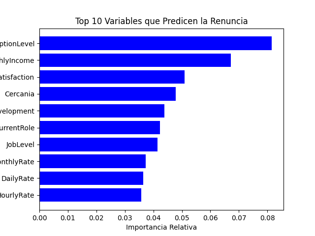
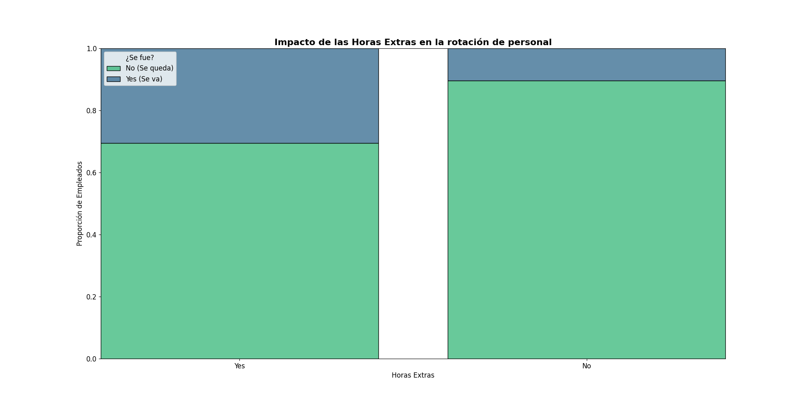
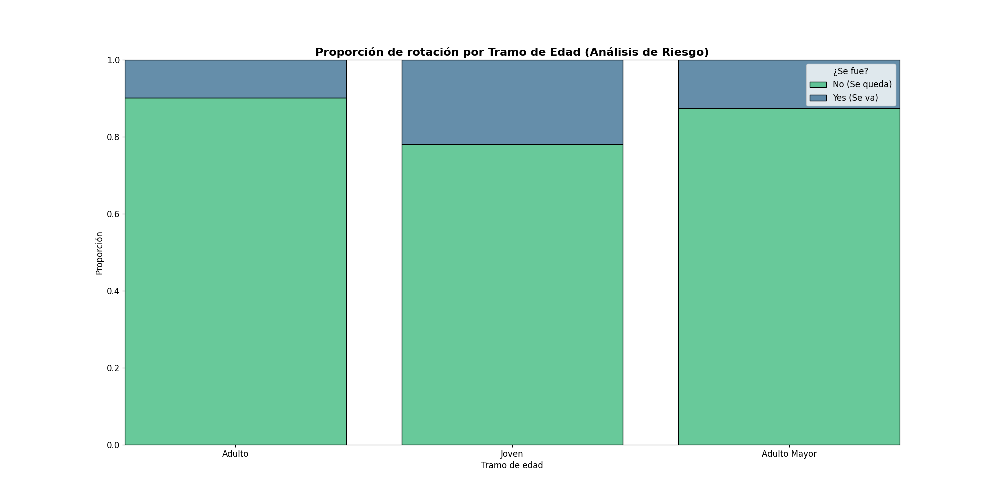

# HR Analytics: Predicción y análisis de rotación de personal

Proyecto de analítica de Recursos Humanos orientado a entender los factores de renuncia (attrition), preparar datos, explorar patrones, entrenar modelos de clasificación y construir visualizaciones para toma de decisiones (incluyendo Power BI).

## Título sugerido para GitHub

**hr-analytics-attrition-prediction**

## Descripción sugerida para GitHub

Análisis de rotación de empleados con Python, SQL y Power BI: limpieza de datos, EDA, modelado predictivo y visualización de insights para retención de talento.

## Objetivos del proyecto

- Analizar variables que influyen en la rotación de personal.
- Construir un pipeline base de preparación de datos.
- Entrenar y evaluar modelos de machine learning para predecir renuncia.
- Publicar hallazgos en dashboards y reportes.

## Estructura del repositorio

```text
hr_analitycs/
├─ config/
├─ data/
│  ├─ raw/
│  ├─ processed/
│  └─ database/
├─ notebooks/
│  ├─ eda/
│  └─ modeling/
├─ powerbi/
│  ├─ datasets/
│  └─ pbix/
├─ reports/
│  └─ figures/
├─ sql/
│  ├─ ddl/
│  ├─ dml/
│  ├─ stored_procedures/
│  └─ views/
└─ src/
   ├─ features/
   ├─ models/
   └─ visualization/
```

## Dataset

- Archivo base de ejemplo: `data/raw/Employee-Attrition.csv`
- Archivo adicional: `data/raw/employee_optimo.csv`

## Stack

- Python 3.10+
- pandas, numpy
- matplotlib, seaborn, squarify
- scikit-learn, imbalanced-learn
- JupyterLab / Notebook
- SQL
- Power BI

## Instalación

1. Clona el repositorio:

```bash
git clone https://github.com/TU_USUARIO/TU_REPO.git
cd TU_REPO
```

2. Crea y activa un entorno virtual:

```bash
python -m venv .venv
source .venv/Scripts/activate  # Windows (Git Bash)
```

3. Instala dependencias:

```bash
pip install -r requirements.txt
```

## Uso rápido

- EDA: `notebooks/eda/analisis.ipynb`
- Modelado: `notebooks/modeling/modeling.ipynb`
- Funciones auxiliares: `src/features/functions.py`
- Carga e inspección de datos: `src/features/iniciar_dataframe.py`
- Modelo Power BI: `powerbi/pbix/retencion_talento.pbix`
- Versión exportada: `powerbi/pbix/retencion_talento.pdf`

## Visualizaciones

Puedes mostrar imágenes directamente en GitHub. Ejemplos actuales del proyecto:

  

### Capturas de Power BI

Si ya tienes imágenes del dashboard, guárdalas en `reports/figures/` y agrégalas así:

```md
[Dashboard Power BI - Vista general](reports/figures/dashboard_powerbi.png) [Dashboard Power BI - Segmentación](reports/figures/segmentacion_powerbi.png)
```

## Roadmap corto

- Mejorar balanceo de clases y tuning de hiperparámetros.
- Estandarizar pipeline de features para entrenamiento/inferencia.
- Incorporar métricas de negocio para seguimiento de retención.

## Autor

Maxim
